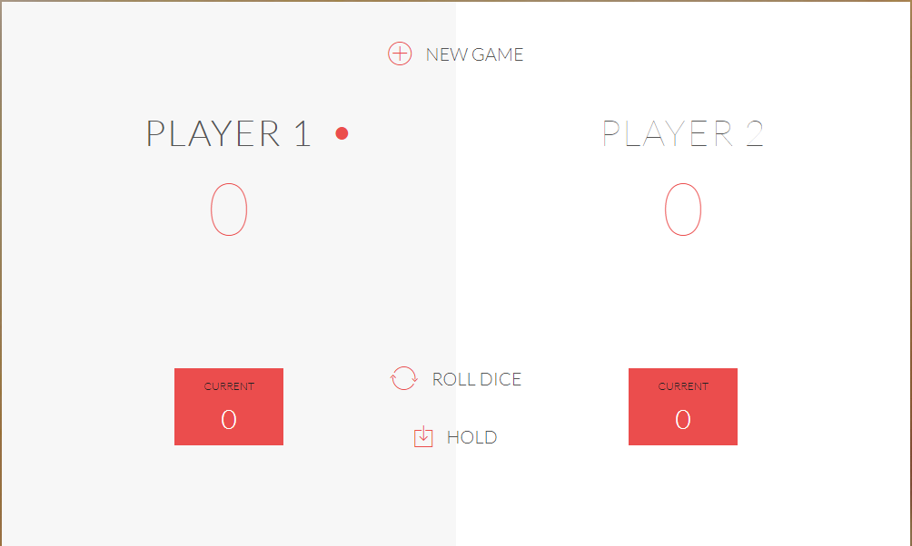

# PigGameDice
## The game has 2 players, playing in rounds
#

## In each turn, a player rolls a dice as many times as he whishes. Each result get added to his ROUND score

#
## The first player to reach 20 points on GLOBAL score wins the game

